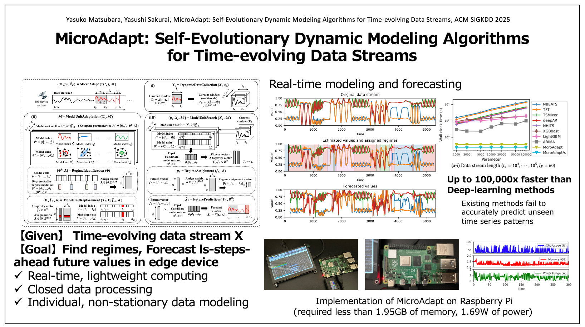

# MicroAdapt: Self-Evolutionary Dynamic Modeling Algorithms for Time-evolving Data Stream




## demo (video)

please see, 

./demo_mocap_86_02.mp4


## demo


**🚧  Coming Soon **

<!-- 
please see, 

 ./notebooks/demo.ipynb


## requirements

### example: pyenv settings

```
$ pyenv install 3.8
$ pyenv virtualenv 3.8 sample
$ pyenv global sample
```

### install packages

```
pip install pykalman
pip install matplotlib
pip install opencv-python 
pip install scikit-learn
pip install pandas
pip install seaborn
pip install tqdm
```


or, 
```
pyenv install 3.8
pyenv virtualenv 3.8 sample
pyenv global sample
pip install -r ./src/requirements.txt
```
 -->
